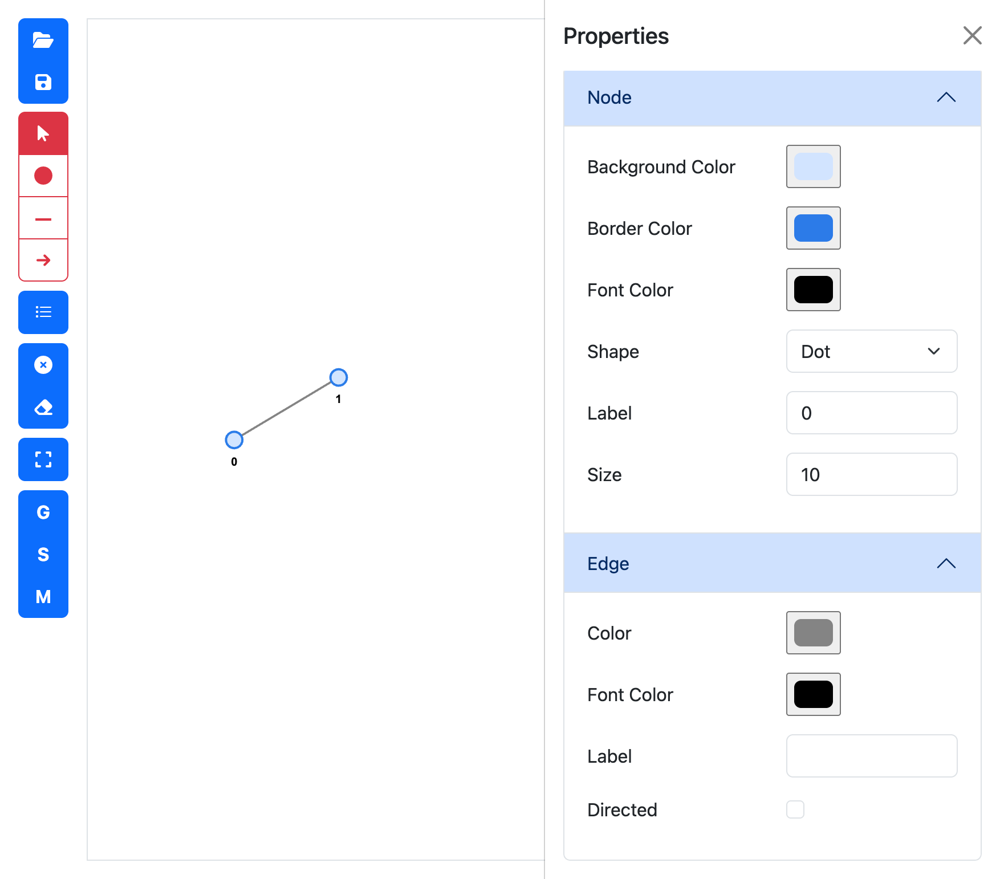
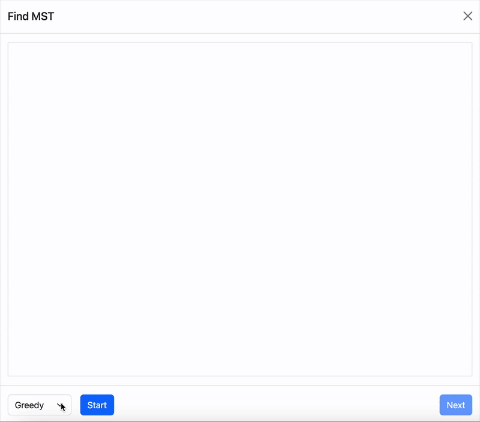

<h1 align="center">Graph Visualizer</h1>

## Introduction
Graph Visualizer is a web application powered by vis.js that allows users to draw graphs and visualize how different graph search algorithms work in real time.

## Layout

    

## Features

    

### Load Graph 
Loads a graph from a `.dot` file, supporting only label properties for nodes and edges. Other styling attributes are not currently supported.

Click the 

### Save Graph
Saves the current graph to a .dot file, including only label properties for nodes and edges. Styling attributes are not included in the exported file.

### Edit Modes
You can switch between four edit modes:

- **Move & Drag**: Allows you to drag individual nodes or move the entire graph.
- **Add Nodes**: Click anywhere on the canvas to add a new node.
- **Add Edges**: Click on a start node, then drag to another node to create an undirected edge.

    

- **Add Directed Edges**: Same as "Add Edges", but the edge will have a direction (arrow) from the start node to the end node.

### Properties
Clicking this will open the Properties sidebar, where you can view and edit the attributes of the selected nodes and edges.

    

### Delete Selected
Delete selected nodes and edges.

### Delete All
Delete all elements in the graph.

### Fit Zoom
Adjusts the view to fit the entire graph within the canvas.

### Generate Graph
Clicking this will open a dialog where you can select options for graph generation, including the graph type and the number of nodes. 

    

Currently, five graph types are supported:
- **Fully Connected Graph**
- **Cycle Graph**
- **Path Graph**
- **Binary Tree**
- **Erdos Renyi Graph**

### Search Graph
Clicking this will open a dialog that allows for interactive search. 

    

1. Select one search algorithm from **DFS**, **BFS** and **Dijkstra's**.
2. Click `Start`. The same graph will be display in the canvas.
3. Select a start node in the graph.
4. Continue clicking `Next` until the entire search process is complete. You can click `Start` again to restart the search.

### Find MST
Clicking this will open a dialog for interactively generating a Minimum/Maximum Spanning Tree (MST). 

    

1. Select one algorithm from **Greedy** and **Kruskal's**.
2. Click `Start`. The same graph will be display in the canvas.
3. Continue clicking `Next` until the whole process is complete. You can click `Start` again to restart.

